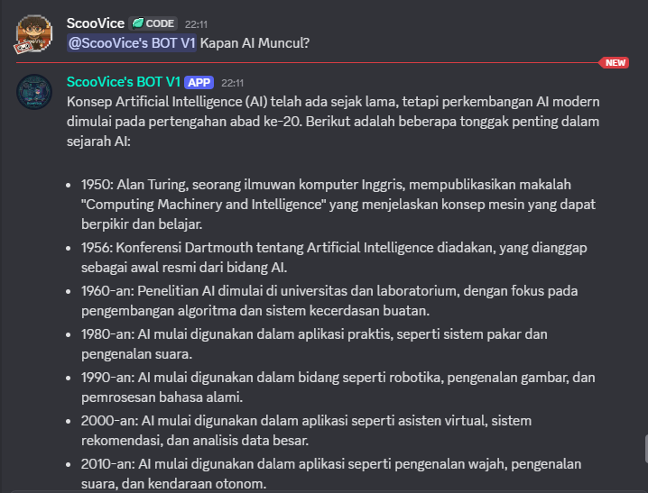

# 🤖 ScooVice's Discord Bot V1

Discord AI Chatbot yang powerful menggunakan Groq API (Llama 3.3 70B) - **Gratis & Unlimited!**

## ✨ Features

- 🤖 **AI-Powered Responses** - Menggunakan Groq API dengan model Llama 3.3 70B
- 💬 **Conversation Memory** - Bot mengingat percakapan sebelumnya per user
- ⚡ **Super Fast** - Response time yang sangat cepat berkat Groq infrastructure
- 🆓 **Gratis Unlimited** - Tidak ada biaya sama sekali!
- 🔄 **Auto-Restart** - System yang reliable dengan error handling

## 📸 Screenshots

**

## 🛠️ Technologies Used

- **Python 3.13**
- **discord.py** - Discord API wrapper
- **Groq API** - AI inference platform
- **python-dotenv** - Environment variables management

## 📋 Commands

| Command | Description |
|---------|-------------|
| `@Bot mention` | Chat dengan AI bot |
| `!reset` | Reset conversation history |
| `!bothelp` | Tampilkan panduan penggunaan |
| `!model` | Info model AI yang digunakan |

## 🚀 Installation & Setup

### Prerequisites

- Python 3.8 atau lebih tinggi
- Discord Bot Token ([Discord Developer Portal](https://discord.com/developers/applications))
- Groq API Key ([Groq Console](https://console.groq.com))

### Step 1: Clone Repository

```bash
git clone https://github.com/ScooVice/ScooVice-discord-bot-v1.git
cd ScooVice-discord-bot-v1
```

### Step 2: Install Dependencies

```bash
pip install -r requirements.txt
```

### Step 3: Setup Environment Variables

1. Copy file `.env.example` menjadi `.env`:
```bash
cp .env.example .env
```

2. Edit file `.env` dan isi dengan token kamu:
```env
DISCORD_TOKEN=your_discord_token_here
GROQ_API_KEY=your_groq_api_key_here
```

### Step 4: Setup Discord Bot

1. Buka [Discord Developer Portal](https://discord.com/developers/applications)
2. Buat aplikasi baru atau pilih yang sudah ada
3. Pergi ke tab **Bot** dan copy token
4. Di **Privileged Gateway Intents**, aktifkan:
   - ✅ Message Content Intent
   - ✅ Presence Intent
   - ✅ Server Members Intent
5. Pergi ke **OAuth2** → **URL Generator**
6. Pilih scope: `bot`
7. Pilih permissions:
   - Send Messages
   - Read Messages/View Channels
   - Read Message History
8. Copy URL dan invite bot ke server kamu

### Step 5: Jalankan Bot

```bash
python ScooVice_BOT_V1.py
```

Bot akan online dan siap digunakan! 🎉

## 💡 Usage Example

```
@ScooVice's BOT V1 Halo! Apa itu Python?
```

Bot akan merespon dengan penjelasan yang detail dan informatif.

## 🔧 Configuration

Bot menggunakan model **Llama 3.3 70B Versatile** dari Groq secara default. Jika ingin mengganti model, edit bagian ini di `ScooVice_BOT_V1.py`:

```python
chat_completion = client.chat.completions.create(
    messages=conversation_history[user_id],
    model="llama-3.3-70b-versatile",  # Ganti model disini
    temperature=0.7,
    max_tokens=1024,
)
```

Model yang tersedia di Groq:
- `llama-3.3-70b-versatile` (Recommended)
- `llama-3.1-70b-versatile`
- `mixtral-8x7b-32768`
- `gemma2-9b-it`

## 🐛 Troubleshooting

### Bot tidak merespon
- Pastikan **Message Content Intent** sudah diaktifkan di Discord Developer Portal
- Cek apakah token Discord dan Groq API key sudah benar di file `.env`

### Error "insufficient_quota"
- Cek saldo/quota Groq API di [Groq Console](https://console.groq.com)
- Groq API gratis unlimited, tapi mungkin ada rate limiting

### Bot sering disconnect
- Pastikan koneksi internet stabil
- Consider deploy ke cloud platform untuk uptime 24/7

## 📝 To-Do / Future Features

- [ ] Slash commands support
- [ ] Embed messages untuk response yang lebih menarik
- [ ] Database integration untuk persistent storage
- [ ] Multi-language support
- [ ] Admin commands (kick, ban, mute)
- [ ] Music player integration

## 🤝 Contributing

Contributions, issues, dan feature requests sangat diterima!

Feel free to check [issues page](https://github.com/ScooVice/ScooVice-discord-bot-v1/issues).

## 📄 License

This project is [MIT](LICENSE) licensed.

## 👤 Author

**ScooVice**

- GitHub: [@ScooVice](https://github.com/ScooVice)
- Discord: scoovice

## 🌟 Show Your Support

Jika project ini membantu kamu, jangan lupa kasih ⭐️!

---

This project will be continue to ScooVice's BOT V2, so just wait and please support, thank you 🤝

---

This Project Made With ❤️ By ScooVice